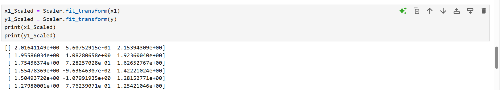
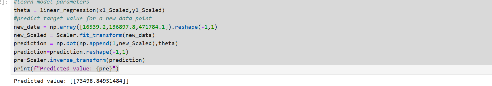

# Implementation-of-Linear-Regression-Using-Gradient-Descent

## AIM:
To write a program to predict the profit of a city using the linear regression model with gradient descent.

## Equipments Required:
1. Hardware – PCs
2. Anaconda – Python 3.7 Installation / Jupyter notebook

## Algorithm
1.Add intercept: Add a column of ones to the input features for the intercept term.

2.Initialize parameters: Set initial values of parameters (theta) to zero.

3.Compute predictions: Multiply features by theta to calculate predictions.

4.Calculate errors: Compute the difference between predictions and actual values.

5.Update parameters: Adjust theta by moving in the opposite direction of the gradient to minimize the error.
## Program:
```
Program to implement the linear regression using gradient descent.
Developed by: SARANYA S.
RegisterNumber:  2122232200101


import pandas as  pd
import numpy as np
from sklearn.preprocessing import StandardScaler
def linear_regression(x1,y,learning_rate=0.01,num_iters=1000):
    #Add a column of oned to x for the intercept team
    x=np.c_[np.ones(len(x1)),x1]
    #initialize theta with zero
    theta = np.zeros(x.shape[1]).reshape(-1,1)
    #perform gradient descent
    for _ in range (num_iters):
        #caclutate predictions
        predictions=(x).dot(theta).reshape(-1,1)
        #calculate errors
        errors = (predictions - y).reshape(-1,1)
        #update theta using gradient descent
        theta-=learning_rate * (1/len(x1))*x.T.dot(errors)
    return theta

x=(data.iloc[1:, :-2].values)
print(x)
x1=x.astype(float)
Scaler=StandardScaler()
y = (data.iloc[1:,-1].values).reshape(-1,1)
print(y)

x1_Scaled = Scaler.fit_transform(x1)
y1_Scaled = Scaler.fit_transform(y)
print(x1_Scaled)
print(y1_Scaled)

#learn model parameters
theta = linear_regression(x1_Scaled,y1_Scaled)
#predict target value for a new data point
new_data = np.array([16539.2,136897.8,471784.1]).reshape(-1,1)
new_Scaled = Scaler.fit_transform(new_data)
prediction = np.dot(np.append(1,new_Scaled),theta)
prediction=prediction.reshape(-1,1)
pre=Scaler.inverse_transform(prediction)
print(f"Predicted value: {pre}")
```

## Output:







## Result:
Thus the program to implement the linear regression using gradient descent is written and verified using python programming.
